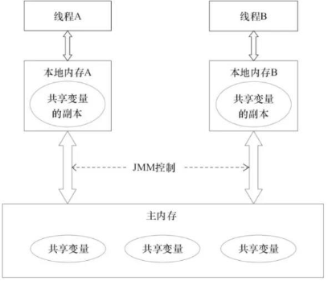
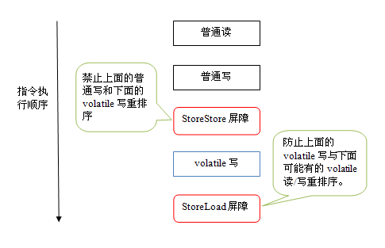

# <center>java并发编程</center>

### 1.请谈谈你对volatile的理解

#### volatile是java虚拟机提供的轻量级的同步机制

* 保证可见性
* 禁止指令重排序
* 不保证原子性

#### JMM(java内存模型)你谈谈

**基本概念**

* JMM本身是一种抽象的概念并不是真实存在的，它描述的是一组规定或者规范，通过这组规范定义了程序中的访问方式
* JMM 同步规定
  * 线程解锁前，必须把共享变量的值刷新回主内存
  * 线程加锁前，必须读取主内存的最新值到自己的工作内存
  * 加锁解锁是同一把锁

* 由于JVM运行程序的实体是线程，而每个线程创建时JVM都会为其创建一个工作内存，工作内存是每个线程的私有数据区域，而Java内存模型中规定所有变量的储存在主内存，主内存是共享内存区域，所有的线程都可以访问，但线程对变量的操作(读取赋值等）必须都在工作内存进行。
* 首先要将变量从主内存拷贝到自己的工作内存空间，然后对变量进行操作，操作完成后再讲变量写回主内存，不能直接操作主内存中的变量，工作内存中存储着主内存中的变量副本拷贝，前面说过，工作内存是每个线程的私有数据区域，因此不同的线程间无法访问对方的工作内存，线程间的通信（传值）必须通过主内存来完成。
* 内存模型图



#### 三大特性

* 可见性

```java
package com.dms.java.concurrency;

/**
 * volatile 可见性代码示例:
 * 如果a不加volatile，线程之间是不可见的。
 * 步骤为：首先在主内存里创建了data变量，Thread-0拷贝一份到自己的工作内存里，
 * 修改了a的值，但是什么时候把数据刷回到主内存是不确定的，即使刷回到主内存在main线程也是不可见的，
 * 因为main线程与Thread-0线程一样会从主内存里拷贝一份至工作内存，所以无论Thread-0如何修改
 * main工作内存里的a始终是0，所以main线程会一致循环，不会走到 “job is done”
 * 
 * 如果加了valatile，表示不同线程间对a都是可见的，Thread-0修改了，
 * 在main线程也能同步看到，所以main线程读取的a为1了，所以可以走到“job is done”
 * @author Dong
 *
 */
public class VolatileVisibleDemo {
	
	public static void main(String[] args) {
		Data data = new Data();
		new Thread(()->{
			System.out.println(Thread.currentThread().getName() + "coming ...");
			try {
				Thread.sleep(3000);
			} catch (Exception e) {
				e.printStackTrace();
			}
			data.addOne();
			System.out.println(Thread.currentThread().getName()+"updated...");
		}).start(); 
		
		while(data.a == 0 ) {
			
		}
		System.out.println(Thread.currentThread().getName() + "job is done");
	}
}

class Data{
	//int a = 0;
	volatile int a = 0;
	void addOne() {
		this.a += 1;
	}
}

```

* 原子性

```java
package com.dms.java.concurrency;

/**
 * volatile 原子性测试示例
 * 不保证原子性
 * @author Dong
 *
 */
public class VolatileAtomDemo {
	
	public static void main(String[] args) {
		test();
	}
	
	private static void test() {
		Data data = new Data();
		
		for(int i=0;i<20;i++) {
			new Thread(()->{
				for(int j =0;j<1000;j++) {
					data.addOne();
				}
			}).start();  
		}
		
//		try {
//			Thread.sleep(5000);
//		} catch (InterruptedException e) {
//			e.printStackTrace();
//		}
		
		 // 默认有 main 线程和 gc 线程
        while (Thread.activeCount() > 2) {
            Thread.yield();
        }
		System.out.println(data.a);
	}
}

//class Data{
//	
//	volatile int a = 0;
//	
//	void addOne() {
//		this.a += 1;
//	}
//	
//}
```

* 有序性

  * 计算机在执行程序时，为了提高性能，编译器和处理器常常会对指令做重排，一般分为以下3种
    * 编译器优化的重排
    * 指令并行的重排
    * 内存系统的重排

  * 单线程环境里面确保程序最终执行的结果和代码执行的结果一致
  * 处理器在进行重排序时必须考虑指令之间的数据依赖性
  * 多线程环境中线程交替执行，由于编译器优化重排的存在，连个线程中使用的变量能否保证一致性是无法确定的，结果无法预测。
  * 代码示例

  ```java
  package com.dms.java.concurrency;
  
  /**
   * 指令重排序的例子
   * 如果两个线程同时执行，method01 和 method02 如果线程 1 执行 method01 重排序了，
   * 然后切换的线程 2 执行 method02 就会出现不一样的结果。
   * @author Dong
   *
   */
  public class ReSortSeqDemo {
  	
  	int a = 0;
  	boolean flag = false;
  	
  	public void method1() {
  		a=1;
  		flag = true;
  	}
  	
  	public void method2() {
  		if(flag) {
  			a = a+3;
  			System.out.println("a= "+a);
  		}
  	}
  	
  	public static void main(String[] args) {
  		ReSortSeqDemo demo = new ReSortSeqDemo();
  		
  		new Thread(()->{
  			demo.method1();
  		}).start();
  		
  		new Thread(()->{
  			demo.method2();
  		}).start();; 
  	}
  
  }
  
  ```

  

#### 禁止指令排序

volatile实现禁止指令重排序的优化，从而避免了多线程环境下程序出现乱序的现象。

先了解一个概念，内存屏障（Memory Barrier）又称内存栅栏，是一个CPU指令，他的作用有两个：

* 保证特定操作的执行顺序
* 保证某些变量的内存可见性（利用该特性实现volatile的内存可见性）

由于编译器和处理器都能执行指令重排序优化，如果在指令间插入一条Memory Barrier，则会告诉编译器和CPU，不管什么指令都不能对这个条Memory Barrier指令重排序，也就是说通过插入内存屏障禁止在内存屏障前后执行重排序优化。内存屏障另一个作用是强制刷出各种CPU缓存数据，因此任务CPU上的线程都能读取到这些数据的最新版本。

下面是保守策略下，volatile写插入内存屏障后生成的指令序列示意图：



下面是保守策略下，volatile读插入内存屏障后生成的指令序列示意图：


#### 线程安全性保证

* 工作内存与主内存同步延迟现象导致可见性问题
  * 可以使用synchronzied或volatile关键字解决，他们可以使用一个线程修改后的变量立即对其他线程可见

* 对于指令重排导致可见性问题和有序问题
  * 可以利用volatile关键字解决，因为volatile的另一个作用就是禁止指令重排序优化

#### 你在哪些地方用到过valatile

##### 单例

* 多线程环境下可能存在的安全问题

```java
package com.dms.java.concurrency;

import java.util.concurrent.ExecutorService;
import java.util.concurrent.Executors;

/**
 * 这个在多线程下达不到单例的效果，多次运行会存在构造函数被调用多次的情况。
 * 发现构造器里的内容会多次输出
 * @author Dong
 *
 */
public class VolatileUseSingleton01 {

	private static VolatileUseSingleton01 instance = null;
	
	private VolatileUseSingleton01() {
		System.out.println(Thread.currentThread().getName() + " construction ....");
	}
	
	public static VolatileUseSingleton01 getInstance() {
		if(instance == null) {
			instance = new VolatileUseSingleton01();
		}
		
		return instance;
	}
	
	public static void main(String[] args) {
		ExecutorService executorService = Executors.newFixedThreadPool(10);
		
		for (int i = 0;i<10;i++) {
			executorService.execute(()->VolatileUseSingleton01.getInstance());
		}
		
		executorService.shutdown();
	}
}

```

* 双重锁单例
  * 代码

```java
package com.dms.java.concurrency;

import java.util.concurrent.ExecutorService;
import java.util.concurrent.Executors;
/**
 * 双重锁单例
 * instance加volatile的必要性：
 * @author Dong
 *
 */
public class VolatileUseSingleton02 {
	
	private static volatile VolatileUseSingleton02 instance = null;
	
	private VolatileUseSingleton02() {
		System.out.println(Thread.currentThread().getName() + " construction...");
	}
	
	public static VolatileUseSingleton02 getInstance() {
		if(instance == null ) {
			synchronized (VolatileUseSingleton02.class) {
				if(instance == null) {
					instance = new VolatileUseSingleton02();
				}
			}
		}
		
		return instance;
	}

	
	public static void main(String[] args) {
		ExecutorService executorService = Executors.newFixedThreadPool(10);
		for(int i=0;i<10;i++) {
			executorService.execute(()->VolatileUseSingleton02.getInstance());
		}
		executorService.shutdown();
	}
}

```

* 如果没有加volatile就不一定是线程安全的，原因是指令重排序的存在，加入volatile可以禁止指令重排序。

* 原因是在于某一个线程执行到第一次检测，读取到的instance不为null时，instance的引用对象可能还没有完成初始化。

* instance = new VolatileUseSingleton02() 可以分为以下三步完成

  > memory = allocate(); // 1.分配对象空间
  >
  > instance（memory）； // 2.初始化对象
  >
  > instance = memory; // 3.设置instance指向刚分配的内存地址，此时instance！=null

* 步骤2和步骤3不存在依赖关系，而且无论重排前还是重排后程序的执行结果在单线程中并没有改变，因此这种优化是允许的。

* 发生重排

  > memory = allocate(); // 1.分配对象空间
  >
  > instance = memory; // 3.设置instance指向刚分配的内存地址，此时instance！=null,但对象还没有初始化完成
  >
  > instance(memory)；//  2.初始化对象

* 所以不加volatile返回的示例不为空，但可能是未初始化的示例。

### 2.CAS你知道吗

* 一个CAS的简单示例：

```java
package com.dms.java.concurrency;

import java.util.concurrent.atomic.AtomicInteger;

/**
 * CAS使用示例  CAS=compare and swap 比较并交换
 * 先比较，比较的内容为：期望值与实际值是否一样，如果一样就交换新值。如果不一样就无法交换，返回false
 * AtomicXX 就是使用了CAS
 * @author Dong
 *
 */
public class CASDemo {

	public static void main(String[] args) {
		AtomicInteger atomicInteger = new AtomicInteger(666);
		boolean b = atomicInteger.compareAndSet(666, 2019);
		System.out.println(b +" atomicInteger value = " + atomicInteger.get());
		
		boolean b1 = atomicInteger.compareAndSet(666, 2020);
		System.out.println(b1 +" atomicInteger value = " + atomicInteger.get());
		
		atomicInteger.getAndIncrement();

	}

}
```

#### CAS底层原理？谈谈对UNSafe的理解？

##### 源码分析 atomicInteger.getAndIncrement();

```java
    /**
     * Atomically increments by one the current value.
     *
     * @return the previous value
     */
    public final int getAndIncrement() {
        return unsafe.getAndAddInt(this, valueOffset, 1);
    }
```

##### UnSafe 类

```java
public class AtomicInteger extends Number implements java.io.Serializable {
    private static final long serialVersionUID = 6214790243416807050L;

    // setup to use Unsafe.compareAndSwapInt for updates
    private static final Unsafe unsafe = Unsafe.getUnsafe();
    private static final long valueOffset;

    static {
        try {
            valueOffset = unsafe.objectFieldOffset
                (AtomicInteger.class.getDeclaredField("value"));
        } catch (Exception ex) { throw new Error(ex); }
    }

    private volatile int value;
    // ...
}
```

* UnSafe是CAS的核心类，由于Java方法无法直接访问底层系统，而需要通过本地（native）方法来访问，UnSafe类相当一个后门，基于该类可以直接操作特定内存的数据。Unsafe类存在于sun.misc包中，其内部方法操作可以像C指针一样直接操作内存，因为Java中CAS操作执行依赖于Unsafe类。
* 变量valueOffset，表示该变量值在内存中的偏移量，因为Unsafe就是根据内存偏移量来获取数据的。
* 变量value用volatile修饰，保证了多线程之间的内存可见性。

##### CAS是什么

* CAS的全称Compare-And-Swap，它是一条CPU并发原语
* 它的功能是判断内存某一个位置的值是否为预期，如果是则更改这个值，这个过程就是原子的。
* CAS并发原子体现在Java语言中就是sun.misc.Unsafe类中的各个方法。调用Unsafe类中的CAS方法，JVM会帮助我们实现出CAS汇编指令。这是一种完全依赖硬件的功能，通过它实现了原子操作。由于CAS是一种系统原语，原语属于操作系统用语范畴，是由若干条指令组成，用语完成某一个功能的过程，并且原语的执行必须是连续的，在执行的过程中不允许被中断，也就是说CAS是一条原子指令，不会造成所谓的数据不一致的问题。

* 分析一下getAndAddInt这个方法

```java
  public final int getAndAddInt(Object paramObject, long paramLong, int paramInt)
  {
    int i;
    do
    {
      i = getIntVolatile(paramObject, paramLong);
    } while (!compareAndSwapInt(paramObject, paramLong, i, i + paramInt));
    return i;
  }
```

#### CAS的缺点？

* 循环时间长开销很大
  * 如果CAS失败，会一直尝试，如果CAS长时间一直不成功，可能会给CPU带来很大的开销（比如线程数很多，每次比较都是失败，就会一直循环），所以希望是线程数比较小的场景
* 只能保证一个共享变量的原子操作
  * 对于多个共享变量操作时，循环CAS就无法保证操作的原子性。
* 引发ABA问题

### 3.原子类AtomicInteger的ABA问题谈一谈？原子更新引用知道吗？

* 原子引用

```java
package com.dms.java.concurrency;

import java.util.concurrent.atomic.AtomicReference;

/**
 * 原子引用使用示例
 * @author Dong
 *
 */
public class AtomicReferenceDemo {
	
	public static void main(String[] args) {
		User zs = new User("zs", 18);
		User ls = new User("ls", 22);
		
		AtomicReference<User> atomicReference = new AtomicReference<>();
		atomicReference.set(zs);
		System.out.println(atomicReference.compareAndSet(zs, ls));
		System.out.println(atomicReference.get());
		
	}
}

class User {
	private String name;
	private int age;
	public String getName() {
		return name;
	}
	public void setName(String name) {
		this.name = name;
	}
	public int getAge() {
		return age;
	}
	public void setAge(int age) {
		this.age = age;
	}
	public User(String name, int age) {
		super();
		this.name = name;
		this.age = age;
	}
	@Override
	public String toString() {
		return "User [name=" + name + ", age=" + age + "]";
	}
	
	
}

```

* ABA问题是怎么产生的

```java
package com.dms.java.concurrency;

import java.util.concurrent.atomic.AtomicReference;

/**
 * ABA问题产生演示
 * 什么是ABA问题：
 * 一个线程获取到了变量值是A，然后改成了B，又改回来了A，另外一个线程同时也获取到了
 * 该变量，它期望是A实际上也是A(只不过中间被改过)，于是就CAS成功。
 * @author Dong
 *
 */
public class ABADemo {
	
	private static AtomicReference<Integer> atomicReference = new AtomicReference<Integer>(100);

	public static void main(String[] args) {
		new Thread(()->{
			atomicReference.compareAndSet(100, 101);
			atomicReference.compareAndSet(101, 100);
		}).start(); 
		
		new Thread(()->{
			try {
				Thread.sleep(1000);
			} catch (InterruptedException e) {
				e.printStackTrace();
			}
			atomicReference.compareAndSet(100, 2019);
			System.out.println(atomicReference.get());
		}).start(); 

	}

}

```

* 解决ABA问题的方案，时间戳原子引用

```java
package com.dms.java.concurrency;

import java.util.concurrent.atomic.AtomicStampedReference;

/**
 * 时间戳原子引用
 * 多了一个类似版本号的变量，在CAS的时候不仅需要期望值与实际值一致，还要求期望版本号与实际版本号一致，才能更新成功。
 * @author Dong
 *
 */
public class AtomicStampedReferenceDemo {

	private static AtomicStampedReference<Integer> atomicStampReference = new AtomicStampedReference<Integer>(100, 1);
	
	public static void main(String[] args) {
		new Thread(()->{
			int stamp = atomicStampReference.getStamp();
			System.out.println(Thread.currentThread().getName() + " 的版本号为："+stamp);
			try {
				Thread.sleep(1000);
			} catch (InterruptedException e) {
				e.printStackTrace();
			}
			atomicStampReference.compareAndSet(100, 101, atomicStampReference.getStamp(), atomicStampReference.getStamp()+1);
			atomicStampReference.compareAndSet(101, 100, atomicStampReference.getStamp(), atomicStampReference.getStamp()+1);
		}).start(); 
		
		
		new Thread(()->{
			int stamp = atomicStampReference.getStamp();
			System.out.println(Thread.currentThread().getName() + "的版本号为:"+stamp);
			try {
				Thread.sleep(3000);
			} catch (InterruptedException e) {
				e.printStackTrace();
			}
			boolean b = atomicStampReference.compareAndSet(100, 2019, stamp, stamp+1);
			System.out.println(b);
			System.out.println(atomicStampReference.getReference());
		}).start(); 

	}

}

```

### 4.我们知道ArrayList是线程不安全，请编写一个不安全的案例并给出解决方案？

* 故障现象

```java
package com.dms.java.concurrency;

import java.util.ArrayList;
import java.util.List;
import java.util.Random;

/**
 * 多线程下操作线程不安全集合的后果
 * 报java.util.ConcurrentModificationException的异常。
 * @author Dong
 *
 */
public class ConcurrentModificationExceptionDemo {
	public static void main(String[] args) {
		List<Integer> list = new ArrayList<>();
		Random random = new Random();
		for (int i = 0; i < 100; i++) {
			new Thread(()->{
				list.add(random.nextInt(10));
				System.out.println(list);
			}).start(); 
		}
	}
}

```

* 导致原因
  * 并发修改导致的异常

* 解决方案

  * new Vector() Vector是线程安全的集合类 （方法上添加了 **synchronized** 关键字）
  * Collections.synchronizedList(new ArrayList()); 可以通过Collections工具类把不安全的集合类转为线程安全的集合类。 （在操作方法上同样是加了 **synchronized**关键字）

  * new CopyOnWriteArrayList()  (内部使用的是轻量级的**ReentrantLock**实现)

* 优化建议
  * 在读多写少的时候推荐使用 CopyOnWriteArrayList这个类

### 5.JAVA中的锁知道哪些？请手写一个自旋锁

#### 公平和非公平锁

* 是什么
  * **公平锁**： 是指多个线程按照申请的顺序来获取值
  * **非公平锁**： 是指多个线程获取值的顺序并不是按照申请锁的顺序，有可能后申请的线程比先申请的线程优先获取锁，在高并发的情况下，可能会造成优先级翻转或者饥饿现象。

* 两者区别
  * **公平锁：**在并发环境中，每一个线程在获取锁时会先查看此锁维护的等待队列，如果为空，或者当前线程是等待队列的第一个就占有锁，否则就会加入到等待队列中，以会按照FIFO的规则获取锁。
  * **非公平锁**：一上来就尝试占有锁，如果失败再进行排队。

#### 可重入锁和不可重入锁

* 是什么
  * **可重入锁：** 指的是同一个线程外层函数获得锁以后，内层仍然能获取到该锁，同一个线程在外层方法获取锁的时候，在进入内层方法时会自动获取该锁。
  * **不可重入锁：**所谓不可重入锁，即若当前线程执行某个方法已经获取到了该锁，那么在方法中尝试再次获取锁时，就会获取不到被阻塞。

* 代码实现

  * 可重入锁

    ```java
    package com.dms.java.concurrency;
    
    /**
     * 可重入锁示例
     * Reentrant [riːˈɛntrənt]的英文单词意思就是：可重入的
     * @author Dong
     *
     */
    public class ReentrantLockDemo {
    
    	public static void main(String[] args) {
    		
    	}
    	
    	boolean isLocked = false;
    	Thread lockedBy = null;
    	int lockedCount = 0;
    	
    	public synchronized void lock() throws Exception{
    		Thread thread = Thread.currentThread();
    		
    		while(isLocked && lockedBy != thread) {
    			wait();
    		}
    		
    		isLocked = true;
    		lockedCount++;
    		lockedBy = thread;
    	}
    	
    	public synchronized void unlock() {
    		if(Thread.currentThread() == lockedBy) {
    			lockedCount--;
    			if(lockedCount == 0) {
    				isLocked = false;
    				notify();
    			}
    		}
    	}
    			
    }
    
    package com.dms.java.concurrency;
    
    /**
     * 可重入锁示例,测试类
     * @author Dong
     *
     */
    public class ReentrantLockDemoTest {
    
    	ReentrantLockDemo lock = new ReentrantLockDemo();
    	
    	public void print() throws Exception {
    		lock.lock();
    		doAdd();
    		lock.unlock();
    	}
    	
    	public void doAdd() throws Exception {
    		lock.lock();
    		System.out.println("ReentrantLock");
    		lock.unlock();
    	}
    	public static void main(String[] args) throws Exception {
    		ReentrantLockDemoTest test = new ReentrantLockDemoTest();
    		test.print();
    
    	}
    
    }
    
    ```

    发现可以输出 ReentrantLock，我们设计两个线程调用 print() 方法，第一个线程调用 print() 方法获取锁，进入 lock() 方法，由于初始 lockedBy 是 null，所以不会进入 while 而挂起当前线程，而是是增量 lockedCount 并记录 lockBy 为第一个线程。接着第一个线程进入 doAdd() 方法，由于同一进程，所以不会进入 while 而挂起，接着增量 lockedCount，当第二个线程尝试lock，由于 isLocked=true，所以他不会获取该锁，直到第一个线程调用两次 unlock() 将 lockCount 递减为0，才将标记为 isLocked 设置为 false。

  * 不可重入锁

  ```java
  package com.dms.java.concurrency;
  
  /**
   * 不可重入锁
   * @author Dong
   *
   */
  public class NotReentrantLockDemo {
  
  	private boolean isLocked = false;
  	
  	public synchronized void lock() throws InterruptedException {
  		while(isLocked) {
  			wait();
  		}
  		isLocked = true;
  	}
  	
  	public synchronized void unlock() {
  		isLocked = false;
  		notify();
  	}
  }
  
  package com.dms.java.concurrency;
  
  /**
   * 可重入锁示例,测试类
   * @author Dong
   *
   */
  public class ReentrantLockDemoTest {
  	NotReentrantLockDemo lock = new NotReentrantLockDemo(); // 不可重入锁
  	// ReentrantLockDemo lock = new ReentrantLockDemo(); // 可重入锁
  	
  	public void print() throws Exception {
  		lock.lock();
  		doAdd();
  		lock.unlock();
  	}
  	
  	public void doAdd() throws Exception {
  		lock.lock();
  		System.out.println("ReentrantLock");
  		lock.unlock();
  	}
  	public static void main(String[] args) throws Exception {
  		ReentrantLockDemoTest test = new ReentrantLockDemoTest();
  		test.print();
  
  	}
  
  }
  
  ```

  当前线程执行print()方法首先获取lock，接下来执行doAdd()方法就无法执行doAdd()中的逻辑，必须先释放锁。这个例子很好的说明了不可重入锁。

* synchronized和ReentrantLock都是可重入锁

  * synchronized

  ```java
  package com.dms.java.concurrency;
  
  /**
   * synchronized 是可重入锁 示例
   * @author Dong
   *
   */
  public class ReentrantLockSynchronizedDemo {
  
  	private synchronized void print() {
  		doAdd();
  	}
  
  	private synchronized void doAdd() {
  		System.out.println("doAdd....");
  	}
  	
  	public static void main(String[] args) {
  		ReentrantLockSynchronizedDemo demo = new ReentrantLockSynchronizedDemo();
  		demo.print();  //打印出：doAdd....
  	}
  }
  
  ```

  上面可以说明synchronized是可重入锁

  * ReentrantLock

  ```java
  package com.dms.java.concurrency;
  
  import java.util.concurrent.locks.Lock;
  import java.util.concurrent.locks.ReentrantLock;
  
  /**
   * ReentrantLock 是可重入锁(从名字上也能看出来)
   * @author Dong
   *
   */
  public class ReentrantLockTest {
  
  	public static void main(String[] args) {
  		ReentrantLockTest test = new ReentrantLockTest();
  		test.print();
  
  	}
  	
  	private Lock lock = new ReentrantLock();
  	
  	private void print() {
  		lock.lock();
  		doAdd();
  		lock.unlock();
  	}
  
  	private void doAdd() {
  		lock.lock();
  		lock.lock();
  		System.out.println("doAdd....");
  		lock.unlock();
  		lock.unlock();	
  	}
  }
  
  ```

  上面例子可以说明 ReentrantLock 是可重入锁，而且在 #doAdd 方法中加两次锁和解两次锁也可以。

#### 自旋锁

* 是指尝试获取锁的线程不会立即阻塞，而是采用循环的方式去尝试获取锁，这样的好处是减少线程上下文切换的消耗，缺点就是循环会消耗CPU

* 手动实现自旋锁

  ```java
  package com.dms.java.concurrency;
  
  import java.util.concurrent.atomic.AtomicReference;
  
  /**
   * 自旋锁示例
   * @author Dong
   *
   */
  public class SpinLockDemo {
  
  	private AtomicReference<Thread> atomicReference = new AtomicReference<Thread>();
  	
  	private void lock() {
  		System.out.println(Thread.currentThread()+ " coming....");
  		while(!atomicReference.compareAndSet(null, Thread.currentThread())) {
  			
  		}
  	}
  	
  	private void unlock() {
  		Thread thread = Thread.currentThread();
  		atomicReference.compareAndSet(thread, null);
  		System.out.println(thread+" unlock...");
  	}
  	
  	public static void main(String[] args) {
  		SpinLockDemo lock = new SpinLockDemo();
  		
  		new Thread(()->{
  			lock.lock();
  			try {
  				Thread.sleep(3000);
  			} catch (InterruptedException e) {
  				e.printStackTrace();
  			}
  			System.out.println("hahaha");
  			lock.unlock();
  		}).start(); 
  		
  		try {
  			Thread.sleep(1000);
  		} catch (InterruptedException e) {
  			e.printStackTrace();
  		}
  		
  		new Thread(()->{
  			lock.lock();
  			System.out.println("hehehe");
  			lock.unlock();
  		}).start(); 
  	}
  }
  
  ```

  输出

  ```
  Thread[Thread-0,5,main] coming....
  Thread[Thread-1,5,main] coming....
  hahaha
  Thread[Thread-0,5,main] unlock...
  hehehe
  Thread[Thread-1,5,main] unlock...
  
  ```

  获取锁的时候，如果原子引用为空就获取锁，不为空表示有人获取了锁，就循环等待。

#### 独占锁(写锁)/共享锁(读锁)

* 是什么
  * **独占锁：**指该锁一次只能被一个线程持有
  * **共享锁：**该锁可以被多个线程持有

* 对于ReentrantLock和synchronized都是独占锁；对于ReentrantReadWriteLock其读锁是共享锁而写锁是独占锁。读锁的共享可保证并发读是非常高效的，读写、写读和写写的过程是互斥的。

* 读写锁的例子：

  ```java
  package com.dms.java.concurrency;
  
  import java.util.HashMap;
  import java.util.Map;
  import java.util.concurrent.locks.ReentrantReadWriteLock;
  import java.util.concurrent.locks.ReentrantReadWriteLock.ReadLock;
  import java.util.concurrent.locks.ReentrantReadWriteLock.WriteLock;
  
  /**
   * 用缓存来解释什么是读写锁，及用法
   * @author Dong
   *
   */
  public class MyCache {
  
  	private volatile Map<String,Object> map = new HashMap<>();
  	
  	private ReentrantReadWriteLock lock = new ReentrantReadWriteLock();
  	WriteLock writeLock = lock.writeLock();
  	ReadLock readLock = lock.readLock();
  	
  	public void put(String key,Object value) {
  		
  		try {
  			writeLock.lock();
  			System.out.println(Thread.currentThread().getName() + " 正在写入。。。");
  			try {
  				Thread.sleep(1000);
  			} catch (InterruptedException e) {
  				e.printStackTrace();
  			}
  			map.put(key, value);
  			System.out.println(Thread.currentThread().getName() + " 写入完成，写入结果是 " + value);
  		} finally {
  			writeLock.unlock();
  		}
  		
  	}
  	
  	public void get(String key) {
  		try {
  			readLock.lock();
  			System.out.println(Thread.currentThread().getName() + " 正在读。。。。");
  			try {
  				Thread.sleep(1000);
  			} catch (InterruptedException e) {
  				e.printStackTrace();
  			}
  			
  			Object res = map.get(key);
  			System.out.println(Thread.currentThread().getName() + " 读取完成，读取结果是" + res );
  		} finally {
  			readLock.unlock();
  		}
  	}
  }
  
  
  package com.dms.java.concurrency;
  
  public class ReadWriteLockDemo {
  
  	public static void main(String[] args) {
  		MyCache cache = new MyCache();
  		for (int i = 0; i < 5; i++) {
  			final int temp = i;
  			new Thread(()->{
  				cache.put(temp+"", temp + "");
  			}).start(); 
  			
  		}
  		
  		for (int i = 0; i < 5; i++) {
  			final int temp = i;
  			new Thread(()->{
  				cache.get(temp+"");
  			}).start(); 
  			
  		}
  
  	}
  
  }
  
  ```

  结果：

  ```
  Thread-0 正在写入。。。
  Thread-0 写入完成，写入结果是 0
  Thread-2 正在写入。。。
  Thread-2 写入完成，写入结果是 2
  Thread-4 正在写入。。。
  Thread-4 写入完成，写入结果是 4
  Thread-3 正在写入。。。
  Thread-3 写入完成，写入结果是 3
  Thread-1 正在写入。。。
  Thread-1 写入完成，写入结果是 1
  Thread-5 正在读。。。。
  Thread-9 正在读。。。。
  Thread-8 正在读。。。。
  Thread-7 正在读。。。。
  Thread-6 正在读。。。。
  Thread-5 读取完成，读取结果是0
  Thread-7 读取完成，读取结果是2
  Thread-8 读取完成，读取结果是3
  Thread-6 读取完成，读取结果是1
  Thread-9 读取完成，读取结果是4
  
  ```

  能保证读写、写读和写写的过程是互斥的是独享的，读读的时候是共享的。

### 6.CountDownLatch/CyclicBarrier/Semaphore 使用过吗

#### CountDownLatch

让一些线程阻塞直到另一个线程完成一系列操作后才被唤醒。CountDownLatch主要有两个方法，当一个或多个线程调用await方法时，调用线程会被阻塞，其他线程调用countDown方法会将计数减一(调用countDown方法的线程不会阻塞)，当计数值变为零时，因调用await方法被阻塞的线程会被唤醒，继续执行。

假设我们有这么一个场景，教室里有班长和其他6个人在教室上自习，怎么保证班长等其他6个人都走出教室再把教室门给关掉。

```java
package com.dms.java.concurrency;

import java.util.Iterator;

/**
 * CountDownLatch 使用示例
 * @author Dong
 *
 */
public class CountDownLatchDemo {

	public static void main(String[] args) {
		for (int i = 0; i < 6; i++) {
			new Thread(()->{
				System.out.println(Thread.currentThread().getName() + " 离开了教室");
			}).start();
		}
		
		System.out.println("班长把门给关上，离开教室。。。。");
	}
}

```

结果为：

```
班长把门给关上，离开教室。。。。
Thread-1 离开了教室
Thread-5 离开了教室
Thread-2 离开了教室
Thread-0 离开了教室
Thread-4 离开了教室
Thread-3 离开了教室

```

发现班长都没有等他人就把教室门给关了，此时我们就可以使用CountDownLatch来控制。

```java
package com.dms.java.concurrency;

import java.util.Iterator;
import java.util.concurrent.CountDownLatch;

/**
 * CountDownLatch 使用示例
 * @author Dong
 *
 */
public class CountDownLatchDemo {

	public static void main(String[] args) {
		
		CountDownLatch countDownLatch = new CountDownLatch(6);
		
		for (int i = 0; i < 6; i++) {
			new Thread(()->{
				countDownLatch.countDown();
				System.out.println(Thread.currentThread().getName() + " 离开了教室");
			},String.valueOf(i)).start();
		}
		
		try {
			countDownLatch.await();
		} catch (InterruptedException e) {
			e.printStackTrace();
		}
		System.out.println("班长把门给关上，离开教室。。。。");
	}
}

```

此时输入

```html
0 离开了教室
2 离开了教室
5 离开了教室
4 离开了教室
1 离开了教室
3 离开了教室
班长把门给关上，离开教室。。。。

```

#### CyclicBarrier

