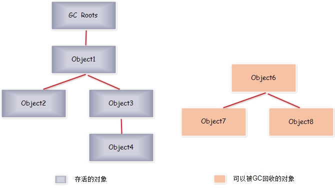
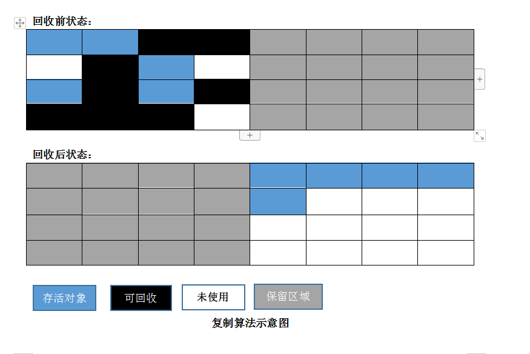
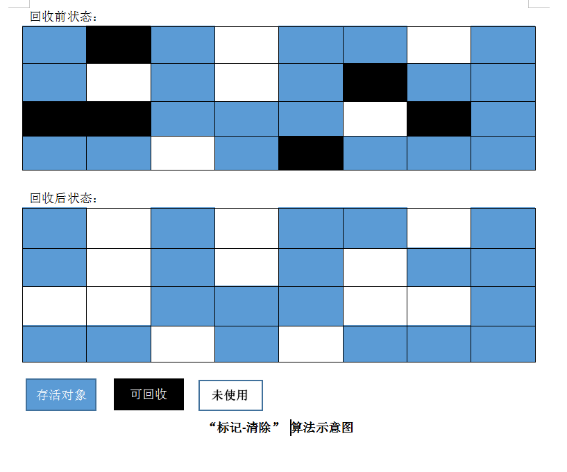
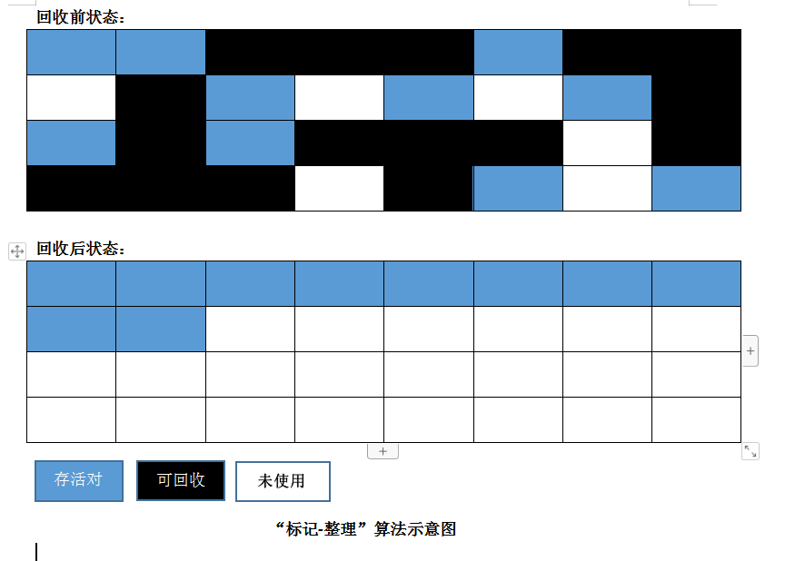
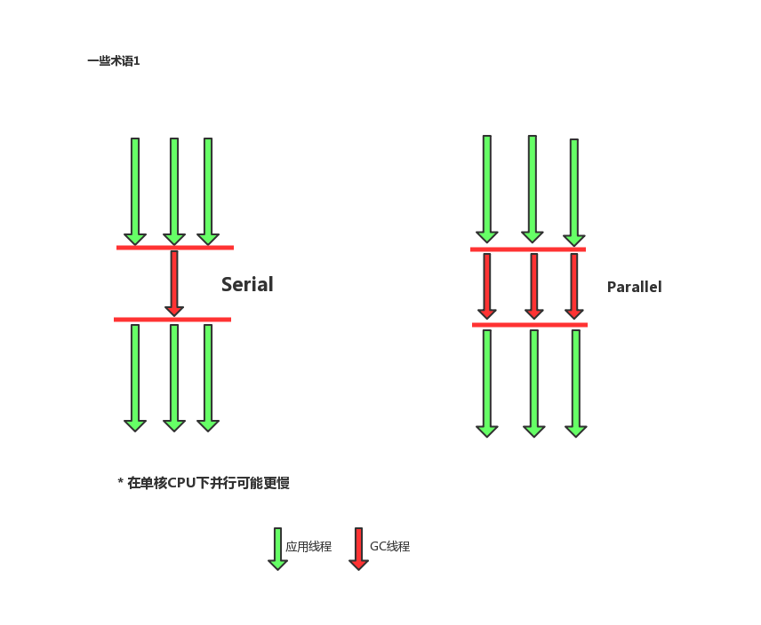
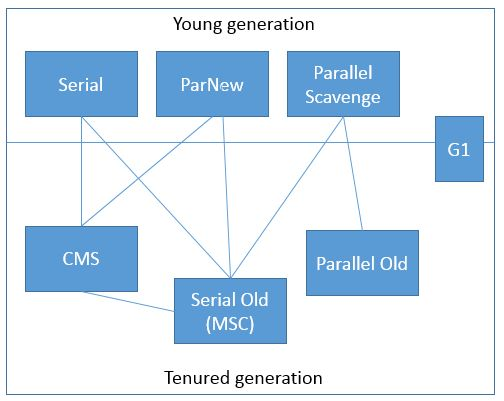
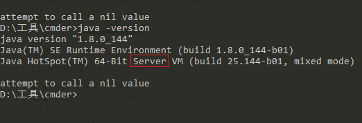
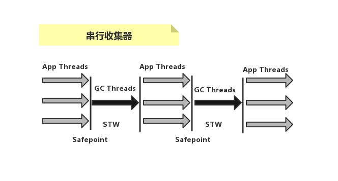
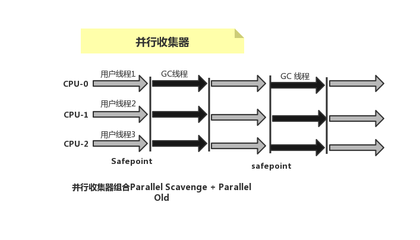
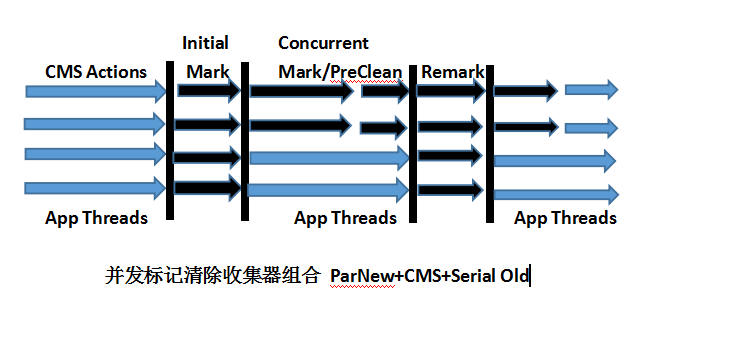

# <center>JVM相关技术</center>

#### 1.JVM结构图


##### 类加载器

> 负责加载class文件，class文件在文件开头有特定的文件标示，讲class文件字节码内容加载到内存中，并将这些内容转换成方法区中的运行时数据结构并且ClassLoader只负责class文件的加载，至于它是否可以运行，则有Execution Engine决定。


  * 加载器种类

    * 启动类加载器(Bootstrap)  C++    getClassLoader()返回的是null，
    * 扩展类加载器（Extension）java  rt.jar
    * 应用程序类加载器（AppClassLoader）
      * java getClassLoader() sun.misc.Launcher$AppClassLoader@18b4aac2
    * 用户自定义加载器，继承classloader

    

* 加载机制(双亲委派机制)

  > 当一个类收到类加载请求，他首先不会尝试自己去加载这个类，而是把这个请求委派给父类去完成，每一个层次类加载器都是如此，因此所有的加载请求都应该传送到启动类加载中，只有当父类加载器反馈自己无法完成这个请求的时候(在它的加载路径下没有找到所需加载的class),子类加载器才会尝试自己去加载。
  >
  > 采用双亲委派的一个好处是比如加载位于rt.jar包中的类java.lang.Object，不管是哪个加载器加载这个类，最终都是委托给顶层的启动类加载器进行加载，这样就保证了使用不同的类加载器最终得到的都是同样的一个Object对象。

* 沙箱安全

#### 栈

* java栈

* 本地方法栈

  > 本地接口 native  private native void start0();

#### 程序计数器    寄存器，指针

#### 2.JVM垃圾回收的时候如何确定垃圾的？知道什么是GC Roots吗？

* 什么是垃圾
  * 简单来说就是内存中已经不在被使用到的空间就是垃圾

* 要进行垃圾回收，如何判断一个对象是否可以被回收
  * 引用计数法
  * 枚举根节点做可达性分析

为了解决引用计数法的循环引用问题，Java使用了可达性算法。



跟踪收集器采用的为集中式的管理方式，全局记录对象之间的引用状态，执行时从一系列GC Roots的对象作为起点，从这些节点向下开始进行搜索所有的引用链，当一个对象到GC Roots没有任何引用链时，则证明此对象是不可用的。

图中，对象object6、object7、object8虽然相互引用，但他们的GC Roots是不可达的，所以他们将会被判定为是可回收的对象。

哪些对象可以作为GC Roots的对象

* 虚拟机栈（栈帧中的局部变量区，也叫局部变量表）中引用的对象
* 方法区中的类静态属性引用的对象
* 方法中常量引用的对象
* 本地方法栈中JNI引用的对象

#### 3.如何盘点查看JVM系统默认值

##### JVM的参数类型

* 标配参数
  * -version
  * -help

* X参数
  * -Xint:解释执行
  * -Xcomp：第一次使用就编译成本地代码
  * -Xmixed：混合模式

* XX 参数

  * Boolean类型：-XX：+或者-某个属性值（+表示开启，-表示关闭）
    * -XX: +PrintGCDetails:打印GC收集细节
    * -XX: -PrintGCDetails:不打印GC收集细节
    * -XX:+UseSerialGC:使用了串行收集器
    * -XX:-UseSerialGC:不使用串行收集器

  * KV设置类型：-XX:key=value
    * -XX:MetaspaceSize=128m 设置元空间的大小为128m
    * -XX:MaxTenuringThread=15 设置最大年龄阀值，默认15 （对象被复制的次数）

  * jinfo举例，如何查看当前运行程序的配置

    ```java
    package com.dms.java.jvm;
    
    /**
     * JVM 参数使用举例
     * 启动后：
     * jps -l 查看进程
     * jinfo -flag 参数 进程号  查看参数值
     * @author Dong
     *
     */
    public class HelloGC {
    	
    	public static void main(String[] args) {
    		System.out.println("hello GC.....");
    		try {
    			Thread.sleep(Integer.MAX_VALUE);
    		} catch (InterruptedException e) {
    			e.printStackTrace();
    		}
    	}
    
    }
    
    ```

    我们可以使用jps -l命令，查出进程id

    

    ​	在使用jinfo -flag PrintGCDetails 9180 命令查看

    ​       	

    ​	 可以看出默认是不打印GC收集细节

    ​	 也可以使用 jinfo -flags 9180 查看所有的参数

  * 两个经典参数： -Xms 和 -Xmx（如-Xms1024）
    * -Xms 等价于 -XX：InitialHeapSize
    * -Xmx 等价于 -XX:MaxHeapSize

#### 4.盘点家底查看JVM默认值

* 查看初始默认值： -XX:+PrintFlagsInitial

  

* 查看修改更新：-XX:+PrintFlagsFinal

  

​     = 和 :=的区别是，一个是默认，一个是人为改变或者jvm加载时改变的参数

* 打印命令行参数（可以看默认垃圾回收器）；-XX:PrintCommandLineFlags

  

#### 5.你平时工作用过的JVM常用基本配置参数有哪些

* -Xms
  * 初始大小内存，默认为物理内存的1/64
  * 等价于-XX:InitialHeapSize

* -Xmx
  * 最大分配内存，默认为物理内存的1/4
  * 等价于 -XX:MaxHeapSize

* -Xss
  * 设置单个线程栈的大小，一般默认为512-2014K
  * 等价于： -XX:ThreadStackSize

* -Xmn
  
  * 设置年轻代的大小
  
* 整个JVM内存大小=年轻代大小+年老代大小+持久代大小，持久代一般固定大小为：64M，所以增大年轻代后，将会减小年老代大小。此值对系统性能影响较大，Sun官方推荐配置为整个堆的3/8
  
* -XX:Metaspacesize
  
  * 设置元空间大小（元空间的本质和永久代类似，都是对JVM规范中的方法区的实现，不过元空间于永久代之间最大的区别在于，元空间并不在虚拟中，而是使用本地内存，因此默认情况下，元空间的大小仅受本地内存限制）
  
* 元空间默认比较小，我们可以调大一点
  
* -XX:+PrintGCDetails

  * 输出详细GC收集日志信息

    * 设置JVM参数为：-Xms10m -Xmx10m -XX:+PrintGCDetails

    * 代码

      ```java
      public class HelloGC {
      	
      	public static void main(String[] args) {
      		 byte[] bytes = new byte[20 * 1024 * 1024];
      	}
      
      }
      ```

      

    * 打印结果：

      ```
      [GC (Allocation Failure) [PSYoungGen: 774K->488K(2560K)] 774K->568K(9728K), 0.0407562 secs] [Times: user=0.00 sys=0.00, real=0.07 secs] 
      [GC (Allocation Failure) [PSYoungGen: 488K->464K(2560K)] 568K->600K(9728K), 0.0088191 secs] [Times: user=0.00 sys=0.00, real=0.01 secs] 
      [Full GC (Allocation Failure) [PSYoungGen: 464K->0K(2560K)] [ParOldGen: 136K->532K(7168K)] 600K->532K(9728K), [Metaspace: 2654K->2654K(1056768K)], 0.0340212 secs] [Times: user=0.02 sys=0.00, real=0.03 secs] 
      [GC (Allocation Failure) [PSYoungGen: 0K->0K(2560K)] 532K->532K(9728K), 0.0166999 secs] [Times: user=0.00 sys=0.00, real=0.02 secs] 
      [Full GC (Allocation Failure) [PSYoungGen: 0K->0K(2560K)] [ParOldGen: 532K->520K(7168K)] 532K->520K(9728K), [Metaspace: 2654K->2654K(1056768K)], 0.0040842 secs] [Times: user=0.00 sys=0.00, real=0.00 secs] 
      Exception in thread "main" java.lang.OutOfMemoryError: Java heap space
      	at com.dms.java.jvm.HelloGC.main(HelloGC.java:14)
      Heap
       PSYoungGen      total 2560K, used 61K [0x00000000ffd00000, 0x0000000100000000, 0x0000000100000000)
        eden space 2048K, 3% used [0x00000000ffd00000,0x00000000ffd0f748,0x00000000fff00000)
        from space 512K, 0% used [0x00000000fff00000,0x00000000fff00000,0x00000000fff80000)
        to   space 512K, 0% used [0x00000000fff80000,0x00000000fff80000,0x0000000100000000)
       ParOldGen       total 7168K, used 520K [0x00000000ff600000, 0x00000000ffd00000, 0x00000000ffd00000)
        object space 7168K, 7% used [0x00000000ff600000,0x00000000ff6820b8,0x00000000ffd00000)
       Metaspace       used 2686K, capacity 4486K, committed 4864K, reserved 1056768K
        class space    used 289K, capacity 386K, committed 512K, reserved 1048576K
      
      ```

      

* GC 

  
  
* FullGC

  

* -XX：SurvivorRatio
  * 设置新生代中eden和S0/S1空间比例
  * 默认-XX:SurvivorRatio=8,Eden:S0:S1=8:1:1

* -XX:NewRatio
  * 配置年轻代和老年代在堆结构的占比
  * 默认-XX:NewRatio=2 新生代占1，老年代占2，年轻代占整个堆的1/3

* -XX:MaxTenuringThreshold
  
  * 设置垃圾最大年龄

#### 6.强引用、软引用、弱引用和虚引用分别是什么

在java语言中，除了基本数据类型外，其他的都是指向各类对象的对象引用；java中根据其生命周期的长短，讲引用分为4类。

* 强引用
  
* 特点：我们平常典型编码Object obj = new Object()中的obj就是强引用。通过关键字new创建的对象所关联的引用就是强引用。当JVM内存空间不足，JVM宁愿抛出OutOfMemoryError运行时错误（OOM），使程序异常终止，也不会靠随意回收具有强引用的“存活”对象来解决内存不足的问题。对于一个普通的对象，如果没有其他的引用关系，只要超过了引用的作用域或者显式地讲相应强引用赋值为null，就是可以被垃圾收集的了，具体回收时机还是要看垃圾收集策略。
  
* 软引用
  * 特点：软引用通过SoftReference类实现。软引用的生命周期比强引用短一些。只有当JVM认为内存不足时，才会去试图回收软引用指向的对象：即JVM会确保抛出OOM之前，清理软引用指向的对象。软引用可以和一个引用队列（ReferenceQueue）联合使用，如果软引用所引用的对象被垃圾回收器回收，java虚拟机就会把这个软引用加入到与之关联的引用队列中。后续，我们可以调用ReferenceQueue的poll方法来检查是否有他所关心的对象被回收。如果队列为空，讲返回一个null，否则该方法返回队列中前面一个Reference对象。
  * 应用场景：软引用通常用来实现内存敏感的缓存。如果还有空闲内存，就可以暂时保留缓存，当内存不足时清理掉，这样就保证了使用缓存的同时，不会耗尽内存。
  
  * 代码示例
  
    设置JVM参数为：`-Xms10m -Xmx10m -XX:+PrintGCDetails`
  
    ```java
    package com.dms.java.jvm;
    
    import java.lang.ref.SoftReference;
    
    /**
     * 软引用示例
     * @author Dong
     *
     */
    public class SoftReferenceDemo {
    	
    	public static void softRef_Memory_Enough() {
    		Object o1 = new Object();
    		SoftReference<Object> softReference = new SoftReference<Object>(o1);
    		System.out.println(o1);
    		System.out.println(softReference.get());
    	}
    	
    	/**
    	 * -Xms10m -Xmx10m -XX:+PrintGCDetail
    	 */
    	public static void softRef_Memory_NotEnough() {
    		Object obj = new Object();
    		SoftReference<Object> softReference = new SoftReference<Object>(obj);
    		obj = null;
    		
    		try {
    			byte[] bytes = new byte[20*1024*1024];
    		} catch (Exception e) {
    			e.printStackTrace();
    		}finally {
    			System.out.println("软引用:"+softReference.get());
    		}
    	}
    	
    	public static void main(String[] args) {
    		//softRef_Memory_Enough(); 
    		softRef_Memory_NotEnough();
    	}
    
    } 
    
    ```
  
    
  
    输出：
  
    ```java
    [GC (Allocation Failure) [PSYoungGen: 774K->496K(2560K)] 774K->584K(9728K), 0.0057949 secs] [Times: user=0.00 sys=0.00, real=0.02 secs] 
    [GC (Allocation Failure) [PSYoungGen: 496K->496K(2560K)] 584K->584K(9728K), 0.0063902 secs] [Times: user=0.01 sys=0.00, real=0.01 secs] 
    [Full GC (Allocation Failure) [PSYoungGen: 496K->0K(2560K)] [ParOldGen: 88K->533K(7168K)] 584K->533K(9728K), [Metaspace: 2654K->2654K(1056768K)], 0.0158053 secs] [Times: user=0.02 sys=0.00, real=0.02 secs] 
    [GC (Allocation Failure) [PSYoungGen: 0K->0K(2560K)] 533K->533K(9728K), 0.0004435 secs] [Times: user=0.00 sys=0.00, real=0.00 secs] 
    [Full GC (Allocation Failure) [PSYoungGen: 0K->0K(2560K)] [ParOldGen: 533K->520K(7168K)] 533K->520K(9728K), [Metaspace: 2654K->2654K(1056768K)], 0.0144424 secs] [Times: user=0.01 sys=0.00, real=0.01 secs] 
    软引用:null
    Exception in thread "main" java.lang.OutOfMemoryError: Java heap space
    	at com.dms.java.jvm.SoftReferenceDemo.softRef_Memory_NotEnough(SoftReferenceDemo.java:28)
    	at com.dms.java.jvm.SoftReferenceDemo.main(SoftReferenceDemo.java:38)
    Heap
     PSYoungGen      total 2560K, used 61K [0x00000000ffd00000, 0x0000000100000000, 0x0000000100000000)
      eden space 2048K, 3% used [0x00000000ffd00000,0x00000000ffd0f748,0x00000000fff00000)
      from space 512K, 0% used [0x00000000fff00000,0x00000000fff00000,0x00000000fff80000)
      to   space 512K, 0% used [0x00000000fff80000,0x00000000fff80000,0x0000000100000000)
     ParOldGen       total 7168K, used 520K [0x00000000ff600000, 0x00000000ffd00000, 0x00000000ffd00000)
      object space 7168K, 7% used [0x00000000ff600000,0x00000000ff682358,0x00000000ffd00000)
     Metaspace       used 2687K, capacity 4486K, committed 4864K, reserved 1056768K
      class space    used 289K, capacity 386K, committed 512K, reserved 1048576K
    
    ```
  
    发现当内存不够的时候就会被回收

* 弱引用

  * 特点：弱引用通过WeakReference类实现。弱引用的生命周期比软引用短。在垃圾回收器线程扫描它所管辖的内存区域的过程中，一旦发现了具有弱引用的对象，不管当前内存空间足够与否，都会回收它的存在。由于垃圾回收器是一个优先级很低的线程，因此不一定会很快回收弱引用的对象。弱引用可以和一个引用队列（ReferenceQueue）联合使用，如果弱引用所引用的对象被垃圾回收，java虚拟机就会把这个弱引用加入到与之关联的引用队列中。

  * 应用场景：弱引用同样可用于内存敏感的缓存

  * 代码验证

    ```java
    package com.dms.java.jvm;
    
    import java.util.HashMap;
    import java.util.WeakHashMap;
    
    /**
     * weakhashmap 使用示例  缓存设计使用。
     * @author Dong
     *
     */
    public class WeakHashMapDemo {
    	
    	public static void main(String[] args) {
    		myHashmap();
    		System.out.println("===================================");
    		myWeakHashmap();
    	}
    	
    	public static void myHashmap() {
    		HashMap<Integer, String> map = new HashMap<>();
    		Integer key = new Integer(1);
    		String value = "HashMap";
    		map.put(key, value);
    		System.out.println(map);
    		
    		
    		key = null;
    		System.out.println(map);
    		
    		System.gc();
    		
    		System.out.println(map);
    	}
    	
    	public static void myWeakHashmap() {
    		WeakHashMap<Integer, String> map = new WeakHashMap<>();
    		Integer key = new Integer(2);
    		String value = "WeakHashMap";
    		map.put(key, value);
    		System.out.println(map);
    		
    		
    		key = null;
    		System.out.println(map);
    		
    		System.gc();
    		
    		System.out.println(map);
    	}
    
    }
    
    ```

    输出：

    ```java
    {1=HashMap}
    {1=HashMap}
    {1=HashMap}
    ===================================
    {2=WeakHashMap}
    {2=WeakHashMap}
    {}
    ```

  * 引用队列
  
    ```java
    package com.dms.java.jvm;
    
    import java.lang.ref.ReferenceQueue;
    import java.lang.ref.WeakReference;
    
    /**
     * 引用队列示例（弱引用）
     * @author Dong
     *
     */
    public class ReferenceQueueDemo {
    
    	public static void main(String[] args) throws InterruptedException {
    		Object obj = new Object();
    		ReferenceQueue<Object> referenceQueue = new ReferenceQueue<>();
    		WeakReference<Object> weakReference = new WeakReference<Object>(obj, referenceQueue);
    		System.out.println(obj);
    		System.out.println(weakReference.get());
    		System.out.println(referenceQueue.poll());
    		
    		
    		obj = null;
    		System.gc();
    		Thread.sleep(500);
    		
    		System.out.println("GC之后。。。。。");
    		System.out.println(obj);
    		System.out.println(weakReference.get());
    		System.out.println(referenceQueue.poll());
    
    	}
    
    }
    
    ```
  
    输出
  
    ```java
    java.lang.Object@15db9742
    java.lang.Object@15db9742
    null
    GC之后。。。。。
    null
    null
    java.lang.ref.WeakReference@6d06d69c
    
    ```
  
    会把该对象的包装类即weakReference放入到ReferenceQueue里面，我们可以从queue中获取到相应的对象信息，同时进行额外的处理。比如反向操作，数据清理等。
  
  * 虚引用
  
    * 特点：虚引用也叫幻象引用，通过PhantomReference类来实现。无法通过虚引用访问对象的任何属性和函数。幻象引用仅仅是提供了一种确保对象被finalize以后，做某些事情的机制。如果一个对象仅持有虚引用，那么它就和没有任何引用一样，在任何时候都可能被垃圾回收器回收。虚引用必须和引用队列（ReferenceQueue）联合使用。当垃圾回收器准备回收一个对象时，如果发现它还有虚引用，就会在回收对象的内存之前，把这个虚引用加入到与之关联的引用队列中。
  
      ReferenceQueue queue = new ReferenceQueue();
  
      PhantomReference pr = new PhantomReference(object,queue);
  
      程序可以通过判断引用队列中是否已经加入了虚引用，来了解被引用的对象是否将要被垃圾回收。如果程序发现某个虚引用已经被加入到引用，那么就可以在所引用的对象的内存被回收之前采取一些程序行动。
  
    * 应用场景： 可用来跟踪对象被垃圾回收器回收的活动，当一个虚引用关联的对象被垃圾收集器回收之前会受到一条系统通知。

#### 7.请谈谈你对OOM的理解

* java异常类图

  

* 常见的几种OOM异常

  * **java.lang.StackOverflowError**(产生原因：线程请求的栈深度大于虚拟机所允许的深度)

    在一个函数中调用自己就会产生这个错误

    示例代码：

    ```java
    package com.dms.java.jvm;
    
    /**
     * 出现StackOverflow错误演示。 栈空间溢出
     * @author Dong
     *
     */
    public class StackOverflowErrorDemo {
    	
    	public static void main(String[] args) {
    		stackOverflowError();
    	}
    	
    	public static void stackOverflowError() {
    		stackOverflowError();
    	}
    
    }
    
    ```

    输出：

    ```java
    Exception in thread "main" java.lang.StackOverflowError
    	at com.dms.java.jvm.StackOverflowErrorDemo.stackOverflowError(StackOverflowErrorDemo.java:15)
    	at com.dms.java.jvm.StackOverflowErrorDemo.stackOverflowError(StackOverflowErrorDemo.java:15)
    	at com.dms.java.jvm.StackOverflowErrorDemo.stackOverflowError(StackOverflowErrorDemo.java:15)
    	at com.dms.java.jvm.StackOverflowErrorDemo.stackOverflowError(StackOverflowErrorDemo.java:15)
    	at com.dms.java.jvm.StackOverflowErrorDemo.stackOverflowError(StackOverflowErrorDemo.java:15)
    	at com.dms.java.jvm.StackOverflowErrorDemo.stackOverflowError(StackOverflowErrorDemo.java:15)
    ```

    

  * **java.lang.OutOfMemoryError: Java heap space**（虚拟机扩展时申请不到足够的内存）

    堆空间满了（大对象，创建很多对象）

    示例代码：

    ```java
    package com.dms.java.jvm;
    
    import java.util.Random;
    
    /**
     * 抛出java heap space 异常的演示示例
     * intern():作用；简单来说就是intern用来返回常量池中的某字符串，
     * 				   如果常量池中已经存在该字符串，则直接返回常量池中该对象的引用。
     * 				   否则，在常量池中加入该对象，然后 返回引用
     * 常量池：在jdk1.7之前，字符串常量存储在方法区的PermGen Space。在jdk1.7之后，字符串常量重新被移到了堆中。
     * 
     * 
     * 为了快速演示效果：启动时可配置：-Xms10m -Xmx10m
     * @author Dong
     *
     */
    public class JavaHeapSpaceDemo {
    
    	public static void main(String[] args) {
    		String str = "dms";
    		
    		while(true) {
    			str += str + new Random().nextInt(11111111) + new Random().nextInt(22222222);
    			str.intern();
    		}
    
    	}
    
    }
    
    ```

    输出：

    ```java
    Exception in thread "main" java.lang.OutOfMemoryError: Java heap space
    	at java.util.Arrays.copyOf(Arrays.java:3332)
    	at java.lang.AbstractStringBuilder.ensureCapacityInternal(AbstractStringBuilder.java:124)
    	at java.lang.AbstractStringBuilder.append(AbstractStringBuilder.java:448)
    	at java.lang.StringBuilder.append(StringBuilder.java:136)
    	at com.dms.java.jvm.JavaHeapSpaceDemo.main(JavaHeapSpaceDemo.java:23)
    
    ```

    

  * **java.lang.OutOfMemoryError:GC overhead limit exceeded**

    GC回收时间过长时会抛出OutOfMemoryError。过长的定义是，超过98%的时间用来做GC并且回收了不到2%的堆内存，连续多次GC都只回收不到2%的极端情况下才会抛出。假如不抛出GC overhead limit错误，会发生什么情况呢？cpu使用率会一直是100%，而GC却没有任何进展。

    

    代码示例：

    ```java
    package com.dms.java.jvm;
    
    import java.util.ArrayList;
    import java.util.List;
    
    /**
     * gc overhead limit 异常演示
     * @author Dong
     *
     */
    public class GCOverheadDemo {
    	
    	public static void main(String[] args) {
    		int i = 0;
    		List<Person> list = new ArrayList<Person>();
    		
    		try {
    			while(true) {
    				list.add(new Person());
    				i++;
    			}
    		} catch (Throwable e) {
    			System.out.println("*************i:"+i);
    			e.printStackTrace();
    			throw e;
    		}
    	}
    
    }
    	
    class Person{
    	int age ;
    	String name ;
    }
    ```

    输出：

    ```java
    [Full GC (Ergonomics) [PSYoungGen: 2047K->2047K(2560K)] [ParOldGen: 7040K->7040K(7168K)] 9088K->9088K(9728K), [Metaspace: 2660K->2660K(1056768K)], 0.0378848 secs] [Times: user=0.05 sys=0.00, real=0.04 secs] 
    [Full GC (Ergonomics) [PSYoungGen: 2047K->2047K(2560K)] [ParOldGen: 7041K->7041K(7168K)] 9089K->9089K(9728K), [Metaspace: 2660K->2660K(1056768K)], 0.0294821 secs] [Times: user=0.03 sys=0.00, real=0.03 secs] 
    [Full GC (Ergonomics) [PSYoungGen: 2047K->2047K(2560K)] [ParOldGen: 7043K->7043K(7168K)] 9091K->9091K(9728K), [Metaspace: 2660K->2660K(1056768K)], 0.0330473 secs] [Times: user=0.06 sys=0.00, real=0.03 secs] 
    [Full GC (Ergonomics) [PSYoungGen: 2047K->2047K(2560K)] [ParOldGen: 7044K->7044K(7168K)] 9092K->9092K(9728K), [Metaspace: 2660K->2660K(1056768K)], 0.0294218 secs] [Times: user=0.06 sys=0.00, real=0.03 secs] 
    *************i:305726
    [Full GC (Ergonomics) [PSYoungGen: 2047K->2047K(2560K)] [ParOldGen: 7047K->7046K(7168K)] 9095K->9094K(9728K), [Metaspace: 2679K->2679K(1056768K)], 0.0301962 secs] [Times: user=0.06 sys=0.00, real=0.03 secs] 
    [Full GC (Ergonomics) java.lang.OutOfMemoryError: GC overhead limit exceeded
    	at com.dms.java.jvm.GCOverheadDemo.main(GCOverheadDemo.java:20)
    Exception in thread "main" [PSYoungGen: 2047K->0K(2560K)] [ParOldGen: 7049K->522K(7168K)] 9097K->522K(9728K), [Metaspace: 2685K->2685K(1056768K)], 0.0042286 secs] [Times: user=0.00 sys=0.00, real=0.00 secs] 
    java.lang.OutOfMemoryError: GC overhead limit exceeded
    	at com.dms.java.jvm.GCOverheadDemo.main(GCOverheadDemo.java:20)
    Heap
     PSYoungGen      total 2560K, used 52K [0x00000000ffd00000, 0x0000000100000000, 0x0000000100000000)
      eden space 2048K, 2% used [0x00000000ffd00000,0x00000000ffd0d258,0x00000000fff00000)
      from space 512K, 0% used [0x00000000fff00000,0x00000000fff00000,0x00000000fff80000)
      to   space 512K, 0% used [0x00000000fff80000,0x00000000fff80000,0x0000000100000000)
     ParOldGen       total 7168K, used 522K [0x00000000ff600000, 0x00000000ffd00000, 0x00000000ffd00000)
      object space 7168K, 7% used [0x00000000ff600000,0x00000000ff682b70,0x00000000ffd00000)
     Metaspace       used 2692K, capacity 4486K, committed 4864K, reserved 1056768K
      class space    used 289K, capacity 386K, committed 512K, reserved 1048576K
    ```

    

  * **java.lang.OutOfMemoryError:Direct buffer memory**

    写NIO程序经常使用ByteBuffer来读取或者写入数据，这是一种基于通道（channel）与缓冲区（buffer）的I/O方式，他可以使用native函数库直接分配堆外内存，然后通过一个存储在java堆里面的DirectByteBuffer对象作为这块内存的引用进行操作。这样能在一些场景中显著提高性能，因为避免了在java堆和native堆中来回复制数据。

    ByteBuffer.allocate(capability)这一种方式是分配JVM堆内存，属于GC管辖范围，由于需要拷贝所以速度相对较慢

    ByteBuffer.allocateDirect(capability) 这一种方式是分配OS本地内存，不属于GC管辖范围，由于不需要内存拷贝所以速度相对较快。

    但如果不断分配本地内存，堆内存很少使用，那么JVM就不需要执行GC，DirectByteBuffer对象们就不会被回收，这时候堆内存充足，但本地内存可能已经使用光了，再次尝试分配本地内存就会出现OutOfMemoryError，那冲虚就直接崩溃了。

  * **java.lang.OutOfMemoryError:unable to create new native thread**

    高并发请求服务器时，经常出现如下异常：java.lang.OutOfMemoryError:unable to create new native thread

    准确的讲该native thread 异常与对应的平台有关

    导致原因：

    ​	1.你的应用创建了太多线程了，一个应用进程创建多个线程，超过系统承载极限

    ​	2.你的服务器并不允许你的应用程序创建这么多线程，linux系统默认允许单个进程可以创建的线程数是1024个，超过了就会报java.lang.OutOfMemoryError:unable to create new native thread

    解决办法：

    ​	1.想办法降低你应用程序创建线程的数量，分析应用是否真的需要创建这么多线程，如果不是，改代码将线程数降到最低

    ​	2.对于有的应用，确实需要创建很多线程，远超过linux系统的默认1024个线程的限制，可以通过修改linux服务器配置，扩大linux默认限制。(查看linux默认限制多少线程数：ulimit -u)

    ​	

    * 代码示例：

      ```java
      package com.dms.java.jvm;
      
      /**
       * unable create new thread 报错演示
       * @author Dong
       *
       */
      public class UnableCreateNewThreadDemo {
      	
      	public static void main(String[] args) {
      		for(int i=0; ;i++) {
      			System.out.println("********i:"+i);
      			
      			new Thread(()->{
      					try {
      						Thread.sleep(Integer.MAX_VALUE); // 线程长期存活
      					} catch (InterruptedException e) {
      						e.printStackTrace();
      					}
      				},""+i).start();
      		}
      	}
      
      }
      
      ```

      输出：

      

      创建到4048个才报错，查看该服务器默认的线程数：

      用户不同所支持的线程数也不一样

      

      如何修改默认值：

       vi /etc/security/limits.d/20-nproc.conf （文件名不一定叫20-nproc.conf 反正是**-nproc.conf)

      

      

  * **java.lang.OutOfMemoryError:Metaspace**

    * java 8 之后的版本使用元空间代替了永久代，元空间是方法区在HotSpot中的实现，它与持久代最大的区别是：元空间并不在虚拟机中的内存中而是使用本地内存。

    * 元空间存放的信息
      * 虚拟机加载的类信息
      * 常量池
      * 静态变量
      * 即时编译后的代码

#### 8.GC垃圾回收算法和垃圾收集器的关系？谈谈你的理解？

* 四种GC垃圾回收算法
  * 分代收集算法
  
    * 当前商业虚拟机的垃圾收集都采用“分代收集”算法，这种算法并没有什么新的思想，只是根据对象存活周期的不同讲内存划分为几块。一般是把java堆分为新生代和老年代，这样就可以根据各个年代的特点采用最适当的收集算法。在新生代中，每次垃圾收集时都发现有大批对象死去，只有少量存活，那就选用复制算法，只需要付出少量存活对象的复制成本就可以完成收集。而老年代中因为对象存活率高、没有额外空间对他进行分配担保，就必须使用“标记-清除”或者“标记-整理”算法来进行回收。
  
* 复制回收
  
    算法图：
  
    
  
  * 标记清除
  
    算法图：
  
    
  
  * 标记整理
  
    算法示意图：
  
    
  
* GC算法是内存回收的方法论，垃圾收集器就是算法落实的实现

* 如何查看默认的垃圾收集器

  * java -XX:+PrintCommandLineFlags -version

    

    可以看出java8 默认采用的垃圾回收器为：ParallelGC 

* 目前为止还没有完美的收集器的出现，更加没有万能的收集器，只是针对具体应用最合适的收集器，进行分代收集。

  

* 串行垃圾回收器(Serial)
  
* 它为单线程环境设计且只使用一个线程进行垃圾回收，会暂停所有的用户线程，所以不适合服务环境。
  
* 并行垃圾回收器(Parallel)
  
* 多个垃圾收集线程并行工作，此时用户线程是暂停的，用于科学计算、大数据处理等弱交互场景。
  
* 并发垃圾回收器（CMS）
  
* 用户线程和垃圾收集线程同时执行（不一定是并行，可能是交替执行），不需要停顿用户线程，互联网公司多用它，适用对响应时间有要求的场景

* 注：关于GC的一些术语

  

* G1垃圾回收器

  * G1垃圾回收器将堆内存分割成不同的区域然后并发的对其进行垃圾回收。

#### 9.怎么查看服务器默认垃圾收集器是哪个？生产是如何配置垃圾收集器？谈谈你对垃圾收集器的理解？

* 怎么查看服务器默认垃圾收集器是哪个？
  
* java -XX:+PrintCommandLineFlags -version
  
* java的GC回收类型主要有：、
  * UseSerialGC ， UseParallelGC , UseConcMarkSweepGC , UseParNewGC , UseParallelOldGC , UseG1GC
  * java8以后基本不使用Serial Old

* 垃圾收集器(在一个代配置后，另一个代会默认配置关联。例如在新生代配置了Serial,在老年代就会使用Serial Old)

  

* 参数说明
  * DefNew: Default New Generation
  * Tenured: Old​
  * ParNew: Parallel New Generation
  * PSYoungGen: Parallel Scavenge
  * ParOldGen: Parallel Old Scavenge

* Server/Client 模式分别是什么意思

  * 如何查看使用了什么模式：

    

  

  - - 最主要的差别在于：-Server模式启动时，速度较慢，但是一旦运行起来后，性能将会有很大的提升。
    - 当虚拟机运行在-client模式的时候，使用的是一个代号为C1的轻量级编译器, 而-server模式启动的虚拟机采用相对重量级，代号为C2的编译器，C2比C1编译器编译的相对彻底，服务起来之后,性能更高。
    - 所以通常用于做服务器的时候我们用服务端模式，如果你的电脑只是运行一下java程序，就客户端模式就可以了。当然这些都是我们做程序优化程序才需要这些东西的，普通人并不关注这些专业的东西了。其实服务器模式即使编译更彻底，然后垃圾回收优化更好，这当然吃的内存要多点相对于客户端模式。

* 新生代

  * 串行GC（Serial/Serital Copying）

    * 一句话：一个单线程的收集器，在进行垃圾收集时候，必须暂停其他所有的工作线程直到它收集结束。

      

      * 串行收集器是最古老，最稳定以及效率高的收集器，只使用一个线程去回收但其在进行垃圾收集过程中可能会产生较长的停顿(Stop-The-World状态)。虽然在收集垃圾过程中需要暂停所有其他的工作线程，但是它简单高效，对于限定单个CPU环境来说，没有线程交互的开销可以或得最高的单线程垃圾收集效率，因此Serial垃圾收集器依然是java虚拟机运行在client模式下默认的新生代垃圾收集器。

      * 对应JVM参数是：-XX：+UseSerialGC

        开启后会使用：Serial(Young区用)+Serial Old(Old区用)的收集器组合

        表示：新生代、老年代都会使用串行回收收集器，新生代使用复制算法，老年代使用标记-整理算法

        ```java
        -Xms10m -Xmx10m -XX:+PrintGCDetails -XX:+UseSerialGC
        ```

        打印：

        ```
        Heap
         def new generation   total 3072K, used 103K [0x00000000ff600000, 0x00000000ff950000, 0x00000000ff950000)
          eden space 2752K,   3% used [0x00000000ff600000, 0x00000000ff619cb8, 0x00000000ff8b0000)
          from space 320K,   0% used [0x00000000ff900000, 0x00000000ff900000, 0x00000000ff950000)
          to   space 320K,   0% used [0x00000000ff8b0000, 0x00000000ff8b0000, 0x00000000ff900000)
         tenured generation   total 6848K, used 520K [0x00000000ff950000, 0x0000000100000000, 0x0000000100000000)
           the space 6848K,   7% used [0x00000000ff950000, 0x00000000ff9d20a0, 0x00000000ff9d2200, 0x0000000100000000)
         Metaspace       used 2690K, capacity 4486K, committed 4864K, reserved 1056768K
          class space    used 289K, capacity 386K, committed 512K, reserved 1048576K
        ```

        

  * 并行GC （ParNew）

    * 一句话：使用多线程进行垃圾回收，在垃圾收集时，会stop-the-world暂停其他所有的工作线程直到它收集结束。

      

      * ParNew(并行)收集器其实就是Serial收集器新生代的并行多线程版本，最常见的应用场景是配合老年代的CMS GC工作，其余的行为和Serial收集器完全一样，ParNew垃圾收集器在垃圾收集过程中同样也要暂停所有其他的工作线程。它是很多java虚拟机运行在Server模式下新生代的默认垃圾收集器。

      * 常用对应JVM参数：-XX：+UseParNewGC 启用ParNew收集器，只影响新生代的收集，不影响老年代。开启后，会使用：ParNew（Young区用）+Serial Old的收集器组合，新生代使用复制算法，老年代采用标记-整理算法。但是，ParNew()+Tenured这样的搭配，java8已经不再被推荐，配置后会有如下提示：

        ```java
        Java HotSpot(TM) 64-Bit Server VM warning: Using the ParNew young collector with the Serial old collector is deprecated and will likely be removed in a future release
        ```

        

  * 并行回收GC（Parallel）/ (Parallel Scavenge)

    

    Parallel Scavenge收集器类似ParNew也是一个新生代垃圾收集器，使用复制算法，也是一个并行的多线程的垃圾收集器，俗称吞吐量优先收集器。一句话：串行收集器在新生代和老年代的并行化。

    它重点关注的是：

    ​	可控制的吞吐量（Thoughput=运行用户代码时间/(运行用户代码时间+垃圾收集时间),也即比如程序运行100分钟，垃圾收集时间1分钟，吞吐量就是99%）。高吞吐量意味着高效利用CPU的时间，它多用于在后台运算而不需要太多交互的任务。

    ​	自适应调节策略也是ParallelScavenge收集器与ParNew收集器的一个重要区别。自适应调节策略：虚拟机会根据当前系统的运行情况收集性能监控信息，动态调整这些参数以提供最合适的停顿时间(-XX:MaxGCPauseMillis)或最大的吞吐量。

    ​	常用JVM参数：-XX:+UseParallelGC或-XX:+UseParallelOldGC（可互相激活）使用Parallel Scanvenge收集器。

* 老年代
  
  * CMS（大型互联网公司基本会使用CMS）
  
    CMS收集器（Concurrent Mark Sweep:并发标记清除）是一种以获取最短回收停顿时间为目标的收集器。
  
    适合应用在互联网站或者B/S系统的服务器上，这类应用尤其重视服务器的响应速度。希望系统停顿时间最短。
  
    CMS非常适合堆内存大、CPU核数多的服务器端应用，也是G1出现之前大型应用的首选收集器。
  
    
  
    Concurrent Mark Sweep 并发标记清除，并发收集低停顿，并发指的是与用户线程一起执行。
  
    开启该收集器的JVM参数：-XX:+UseConcMarkSweepGC 开启该参数后会自动讲-XX:+UseParNewGC打开
  
    开启该参数后，使用ParNew（Young区用）+CMS（Old区用）+Serial Old的收集器组合，Serial Old讲作为CMS出错的后备收集器。
  
    ```
    -Xms10m -Xmx10m -XX:+PrintGCDetails -XX:+UseConcMarkSweepGC
    ```
  
    * 步骤分析：
  
      * 初始标记（CMS initial mark）
  
        只是标记一下GC Roots能直接关联的对象，速度很快，仍然需要暂停所有的工作线程。
  
      * 并发标记（CMS concurrent mark）和用户线程一起
  
        进行GC Roots跟踪的过程，和用户线程一起工作，不需要暂停工作线程。主要标记过程，标记全部对象。
  
      * 重新标记（CMS remark）
  
        为了修正在并发标记期间，因用户程序继续运行而导致标记产生变动的那一部分对象的标记记录，仍然需要暂停所有的工作线程。由于并发标记时，用户线程依然运行，因此在正式清理前，再做修正。
  
      * 并发清除(CMS concurrent sweep)和用户线程一起
  
        清除GC Roots不可达对象，和用户线程一起工作，不需要暂停工作线程。基于标记结果，直接清理对象。
  
        由于耗时最长的并发标记和并发清除过程中，垃圾收集线程可以和用户线程一起并发工作。
  
        所以总体上来看CMS收集器的内存回收和用户线程是一起并发地执行。
  
    * 优缺点
  
      * 优点：并发收集低停顿
  
      * 缺点：
  
        * 并发执行，对CPU资源压力大
  
          由于并发进行，CMS收集与应用线程会同时增加对堆内存的占用，也就是说，CMS必须要在老年代堆内存用尽之前完成垃圾回收，否则CMS回收失败时，讲触发担保机制，串行老年代收集器讲会以STW的方式进行一次GC，从而造成较大停顿时间。
  
        * 采用的标记清除算法会导致大量碎片
  
          标记清除算法无法整理空间碎片，老年代空间会随着应用时长被逐步耗尽，最后将不得不通过担保机制对堆内存进行压缩。CMS也提供了参数-XX:CMSFullGCCsForeCompaction（默认0，即每次都进行内存整理）来指定多少次CMS收集之后，进行一次压缩的Full GC。
  
  * 串行GC（Serial Old）/（Serial MSC）
  
    * Serial Old是Serial垃圾收集器老年代版本，它同样是个单线程的收集器，使用标记-整理算法，这个收集器也主要是运行在Client模式的java虚拟机默认的老年代垃圾收集器。

* G1 

  * 以前收集器特点：
    * 年轻代和老年代是各自独立且连续的内存块
    * 年轻代收集使用单eden+S0+S1进行复制算法
    * 老年代收集必须扫描整个老年代区域
    * 都是以尽可能少而快速地执行GC为设计原则

  * G1是什么

    G1是一种服务器端的垃圾收集器，应用在多处理器和大容量内存环境中，在实现高吞吐量的同时，尽可能的满足垃圾收集暂停时间的要求。

    * 特点：
      * 像CMS收集器一样，能与应用程序线程并发执行
      * 整理空闲空间更快
      * 需要更多的时间来预测GC停顿时间
      * 不希望牺牲大量的吞吐性能
      * 不需要更大的Java Heap

    G1收集器的设计目标是取代CMS收集器，它同CMS相比，在以下方面表现的更出色：

    ​	G1是一个有整理内存过程的垃圾收集器，不会产生很多内存碎片

    ​	G1的Stop The World更可控，G1在停顿时间上添加了预测机制，用户可以指定期望停顿时间

  * 底层原理

    * Region区域化垃圾收集器

      最大的好处是化整为零，避免全内存扫描，只需要按照区域来进行扫描即可。

    * 回收步骤

    * 4步过程

  * case案例

  * 常用配置参数

    -XX:+UseG1GC -Xmx32g -XX:MaxGCPauseMillis=100

  * 和CMS相比的优势

    * G1不会产生内存碎片
    * 是可以精确控制停顿。该收集器是把整个堆(新生代、老年代)划分成多个固定大小的区域，每次根据允许停顿的时间去收集垃圾最多的区域。

* 结合项目调参

  * 启动时设置：

    ```java
    java -server jvm的各种参数 -jar  XXXX.jar(war)
    ```

#### 10.生产环境服务器变慢了，谈谈诊断思路和性能评估？

* 整机：top

  * load average 看负载的 （一分钟 五分钟 十五分钟） 超过0.6算高了
  * %CPU
  * %MEM
  * 1 展开CPU
  * q 退出
  * uptime（精简版）也可以看负载

* CPU：vmstat

  * vmstat -n 2 3  （每2秒取样一次 共取样3次）
    * procs
      * r:运行和等待CPU时间片的进程数，原则上1核的cpu的运行队列不要超过2，整个系统的运行队列不能超过总核数的2倍，否则代表系统压力过大。
      * b:等待资源的进程数，比如正在等待磁盘I/O、网络I/O等。

  * mpstat -P all

* 内存：free

  * free （默认是字节）
  * free -g （以g为单位）
  * free -m （以m为单位，常用）
  * pidstat -p 进程号 -r 采样间隔秒数      （查看指定进程占用的内存情况）

* 硬盘：df

  * df -h (-h human)

* 磁盘IO：iostat（如果找不到，需要安装  yum install -y sysstat）

  * iostat -xdk 2 3 
  * pidstat -d 2 -p 5101  查看5101线程占用的磁盘IO

* 网络IO：ifstat

#### 12.*（重要） 假如生产环境出现CPU占用过高，请谈谈你的分析思路和定位？

* 结合linux和JDk命令一块分析

* 案例步骤

  * 先用top命令找出CPU占比最高的
  * ps -ef 或者jps进一步定位，得知是哪一个程序出的问题
  * 定位到具体线程或者代码
    * ps -mp 进程 -o THREAD,tid,time
    * 参数解释：
      * -m 显示所有的线程
      * -p pid进程使用cpu的时间
      * -o 该参数后是用户自定义格式

  * 将需要的线程ID转换为16进制格式（英文小写格式）
  * jstack 进程ID | grep tid(16进制线程ID小写英文) -A60

#### 13 github的骚操作

* in
* stars:>400
* forks:>400
* as