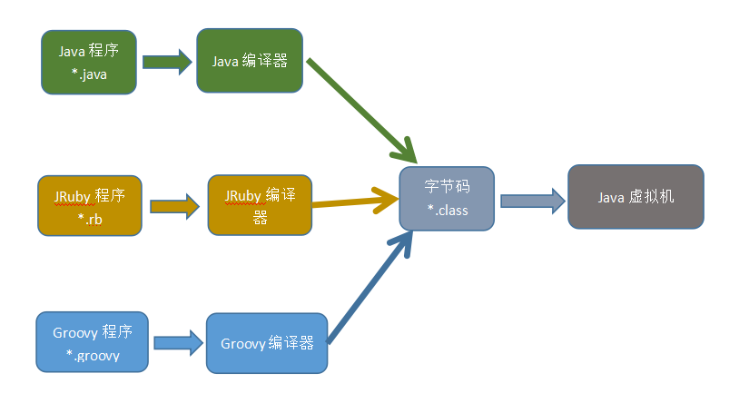
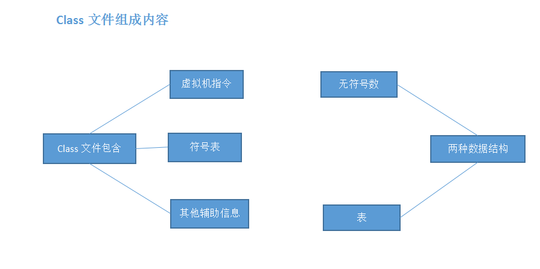
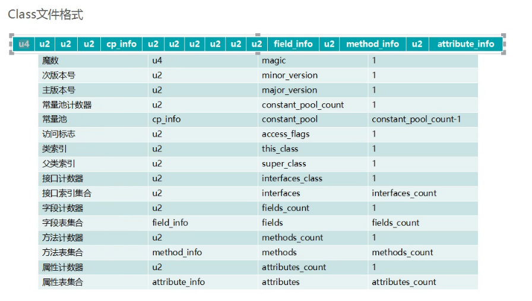
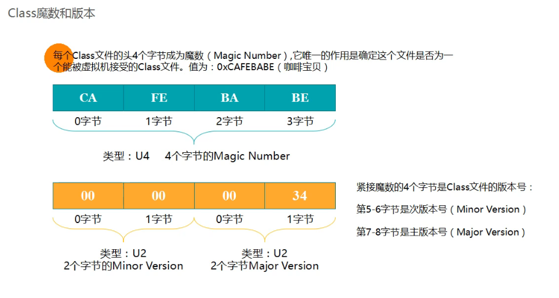

## class文件结构&类加载器

#### Java类文件结构

##### 1.是不是只有Java编译器才能编译成class字节码文件？

* 不是的

  

* Class文件组成内容

  

##### 2.计算机都是以二进制指令进行执行的。

* Class文件格式

  

  ​		什么是u1 u2 u3 u4

  ​		u1 一个字节

  ​		u2 两个字节

  ​		u3 三个字节

  ​		u4 四个字节

  

  * 字节码的具体解释：
    * 第一个u4字节代表这是一个class文件：cafe babe （固定的）
    * 第二个u4字节代表JDK编译的版本号：JDK7-->51,JDK8-->52
    * 

  

