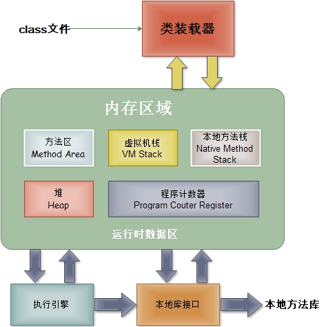
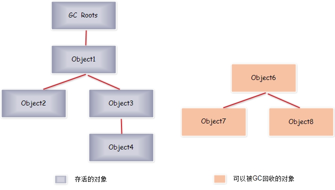
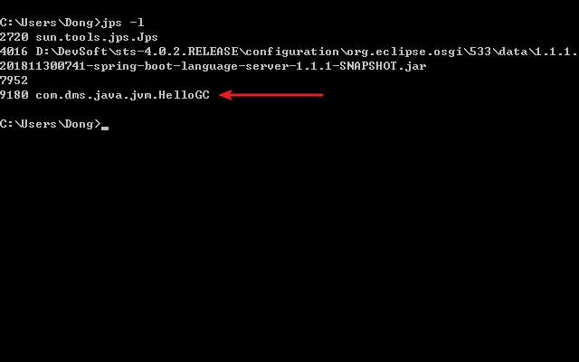
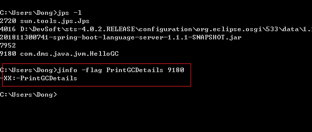
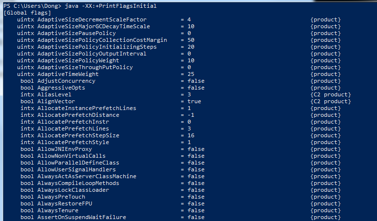
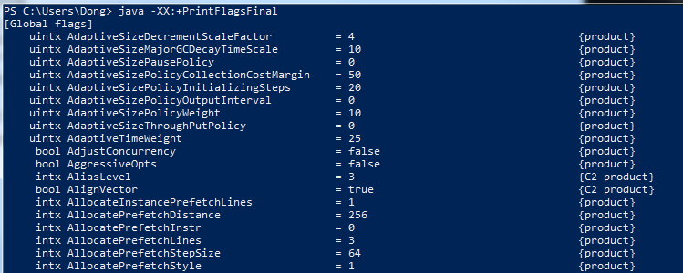
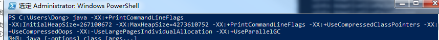

# <center>JVM相关技术</center>

#### 1.JVM结构图



#### 2.JVM垃圾回收的时候如何确定垃圾的？知道什么是GC Roots吗？

* 什么是垃圾
  * 简单来说就是内存中已经不在被使用到的空间就是垃圾

* 要进行垃圾回收，如何判断一个对象是否可以被回收
  * 引用计数法
  * 枚举根节点做可达性分析

为了解决引用计数法的循环引用问题，Java使用了可达性算法。



跟踪收集器采用的为集中式的管理方式，全局记录对象之间的引用状态，执行时从一些列GC Roots的对象作为起点，从这些节点向下开始进行搜索所有的引用链，当一个对象到GC Roots没有任何引用链时，则证明此对象是不可用的。

图中，对象object6、object7、object8虽然相互引用，但他们的GC Roots是不可达的，所以他们将会被判定为是可回收的对象。

哪些对象可以作为GC Roots的对象

* 虚拟机栈（栈帧中的局部变量区，也叫局部变量表）中引用的对象
* 方法区中的类静态属性引用的对象
* 方法中常量引用的对象
* 本地方法栈中JNI引用的对象

#### 3.如何盘点查看JVM系统默认值

##### JVM的参数类型

* 标配参数
  * -version
  * -help

* X参数
  * -Xint:解释执行
  * -Xcomp：第一次使用就编译成本地代码
  * -Xmixed：混合模式

* XX 参数

  * Boolean类型：-XX：+或者-某个属性值（+表示开启，-表示关闭）
    * -XX: +PrintGCDetails:打印GC收集细节
    * -XX: -PrintGCDetails:不打印GC收集细节
    * -XX:+UseSerialGC:使用了串行收集器
    * -XX:-UseSerialGC:不使用串行收集器

  * KV设置类型：-XX:key=value
    * -XX:MetaspaceSize=128m 设置元空间的大小为128m
    * -XX:MaxTenuringThread=15 设置最大年龄阀值，默认15 （对象被复制的次数）

  * jinfo举例，如何查看当前运行程序的配置

    ```java
    package com.dms.java.jvm;
    
    /**
     * JVM 参数使用举例
     * 启动后：
     * jps -l 查看进程
     * jinfo -flag 参数 进程号  查看参数值
     * @author Dong
     *
     */
    public class HelloGC {
    	
    	public static void main(String[] args) {
    		System.out.println("hello GC.....");
    		try {
    			Thread.sleep(Integer.MAX_VALUE);
    		} catch (InterruptedException e) {
    			e.printStackTrace();
    		}
    	}
    
    }
    
    ```

    我们可以使用jps -l命令，查出进程id

    

    ​	在使用jinfo -flag PrintGCDetails 9180 命令查看

    ​       	

    ​	 可以看出默认是不打印GC收集细节

    ​	 也可以使用 jinfo -flags 9180 查看所有的参数

  * 两个经典参数： -Xms 和 -Xmx（如-Xms1024）
    * -Xms 等价于 -XX：InitialHeapSize
    * -Xmx 等价于 -XX:MaxHeapSize

#### 盘点家底查看JVM默认值

* 查看初始默认值： -XX:+PrintFlagsInitial

  

* 查看修改更新：-XX:+PrintFlagsFinal

  

​     = 和 :=的区别是，一个是默认，一个是人为改变或者jvm加载时改变的参数

* 打印命令行参数（可以看默认垃圾回收器）；-XX:PrintCommandLineFlags

  

#### 你平时工作用过的JVM常用基本配置参数有哪些

* -Xms
  * 初始大小内存，默认为物理内存的1/64
  * 等价于-XX:InitialHeapSize

* -Xmx
  * 最大分配内存，默认为物理内存的1/4
  * 等价于 -XX:MaxHeapSize

* -Xss
  * 设置单个线程栈的大小，一般默认为512-2014K
  * 等价于： -XX:ThreadStackSize

* -Xmn
  * 设置年轻代的大小
  * 整个JVM内存大小=年轻代大小+年老代大小+持久代大小，持久代一般固定大小为：64M，所以增大年轻代后，将会减小年老代大小。此值对系统性能影响较大，Sun官方推荐配置为整个堆的3/8

* -XX:Metaspacesize
  * 设置元空间大小（元空间的本质和永久代类似，都是对JVM规范中的方法区的实现，不过元空间于永久代之间最大的区别在于，元空间并不在虚拟中，而是使用本地内存，因此默认情况下，元空间的大小仅受本地内存限制）
  * 元空间默认比较小，我们可以调大一点

* -XX:+PrintGCDetails
  * 输出详细GC收集日志信息